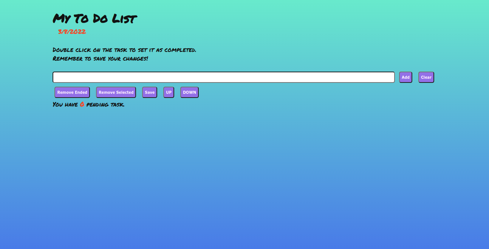

# To Do List Project
  

  
<h2>:brazil: Português</h2>

  Esse é a minha lista de tarefas. Eu o desenvolvi enquanto estava estudando Fundamentos de Desenvolvimento Web no curso da Trybe.

  ## Live Link
  <a href="https://to-do-postit.netlify.app/">To Do List</a>
  
  ## Screenshot
  
  
  ## Objetivos
  * Criar uma lista de tarefas;
  * Possibilitar a adição e remoção de tarefas;
  * Possibilitar remover todas as tarefas;
  * Possibilitar salvar tarefas no localstorage;
  * Possibilitar completar e mover tarefas;
  * Cada tarefa possuir uma cor de background randômica com cores de postIt;
  * Mostrar o número de tarefas pendentes.

  ## Tecnologias Utilizadas
  * HTML
  * CSS
  * Javacript
  * DOM
  * Semantic HTML
  
  
  ## Como usar
  Acesse a página, adicione as suas tarefas, organize as suas tarefas e após completa-las clique duas vezes sobre a tarefa para marca-la como completa. 
   
  Dica: Lembre de salvar o seu trabalho após realizar alterações!	

  ## Informações de Desenvolvimento
  Commits de Desenvolvimento: 12;  
  Tempo Gasto: 3 days;

  
##   
This is My To Do List. I did it while I was studying on the Fundamentals of Web Development in the Trybe course.

## Live Link
<a href="https://to-do-postit.netlify.app/">To Do List</a>
  
## Screenshot

## My Goals
* Create a to do list;
* Allow adding and removing tasks;
* Allow remove all tasks;
* Allow saving tasks on localstorage;
* Allow complete and move tasks;
* Each tasks has a random color of a postIt;
* Show the number of pending tasks.

## Used Technologies
  * HTML
  * CSS
  * Javacript
  * DOM
  * Semantic HTML

## How to use it
  Go to the page, add all your tasks, organize the tasks you have added and after completing the task, double click on it to set as complete. 
   
  Tip: Remember to save your work, after changes!

## Development Information
  Development Commits: 12;  
  Time Spent: 3 days;   
